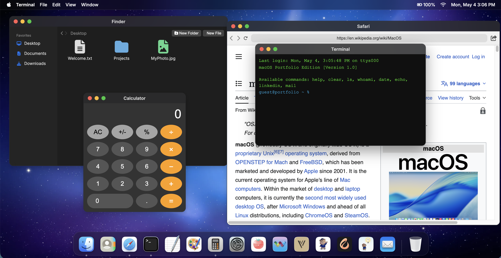

# Christian Arzaluz — Interactive Developer Portfolio

<div align="center">
  
  <br/><br/>
  
  <p>
    <b>An interactive, web-based macOS emulation and App Store showcase built entirely with Vanilla technologies.</b><br>
    <i>Designed for Tech Recruiters and Engineering Managers to explore my iOS development journey.</i>
  </p>

  <div>
    
    
    
    
    
    
    
  </div>
</div>

---

## 👨‍💻 Note for Tech Recruiters & Engineering Managers

Hello! If you are reviewing my profile for an **iOS Developer** or **Frontend Engineer** position, this repository serves as my interactive resume. 

I built this portfolio from scratch without relying on heavy frameworks like React or Tailwind. My goal was to demonstrate strong fundamentals in the DOM, CSS styling, responsive design, and state management, while wrapping it in a polished, Apple-inspired aesthetic.

### ✨ What's Inside the Codebase?

1. **macOS Web Emulation (`/`):** 
   - A fully functional, responsive macOS desktop environment in the browser.
   - Interactive dock, draggable windows, top menu bar, and a working clock.
   - Built purely with Vanilla JavaScript, HTML, and CSS (Glassmorphism).

2. **App Store Showcase (`/portfolio/`):** 
   - A dedicated landing page showcasing my published iOS apps.
   - Features automatic Light/Dark mode switching based on the user's OS preference (`prefers-color-scheme`).
   - Implements native horizontal swipe galleries (`scroll-snap`) mimicking the App Store.
   - Full i18n support (English/Spanish) toggled dynamically without reloading.

---

## 📱 Featured iOS Applications

As an iOS Developer, I specialize in integrating **Artificial Intelligence** (on-device and cloud APIs) into beautifully crafted Swift/SwiftUI applications. All apps are live on the App Store.

| App | Description | Key Technologies |
|-----|-------------|------------------|
| **[Lumina](https://github.com/arzaluz-chris/Lumina)** | Character-strengths app with on-device AI analysis and interactive evolution charts. Zero data collected. | SwiftUI, Apple Intelligence, SwiftData, Charts |
| **[Alba](https://github.com/arzaluz-chris/Alba)** | AI-powered friendship advisor grounded in positive psychology, with an encrypted journal. | Gemini AI, FaceID, Apple Music API |
| **[TeddyFeels](https://github.com/arzaluz-chris/TeddyFeels)** | Emotional well-being companion for kids 6-12 featuring voice journaling. 100% offline. | AVFoundation, Lottie, SwiftData |
| **[VORTH](https://github.com/arzaluz-chris/Journify)** | AI life-coaching app using the PERMA well-being model. Features live voice coaching. | Gemini AI (Voice), CloudKit, Speech |
| **[Cordis](https://github.com/ubaldoorozco/cordis.code.font)** | Heart rate monitoring and meditation tracking with Apple Health integration. | HealthKit, SwiftData, Charts |
| **[Pomo](https://github.com/arzaluz-chris/Pomo)** | Minimalist Pomodoro timer with background execution and streak tracking. | UserNotifications, AppStorage |
| **[WaldenVibes](https://github.com/arzaluz-chris/WaldenVibes)** | Meditation and emotion tracking app designed with a zen, calming user experience. | AVFoundation, CoreData |

---

## 🚀 Running Locally

If you'd like to run this static site locally to review the source code in action:

1. Clone this repository:
   ```bash
   git clone https://github.com/arzaluz-chris/portfolio.git
   ```
2. Open `index.html` directly in your browser, or serve it using a local server:
   ```bash
   # Using Python 3
   python3 -m http.server 8000
   ```
3. Visit `http://localhost:8000`

---

## 📬 Let's Connect

I am actively looking for new opportunities where I can build impactful products and write elegant code. 

- **LinkedIn:** [linkedin.com/in/christianarzaluz](https://linkedin.com/in/christianarzaluz)
- **Portfolio:** [chrisarzaluz.dev](https://chrisarzaluz.dev)
- **Email:** christian.arzaluz@gmail.com

---
*Please see the `LICENSE` file. This repository is provided for demonstration purposes only.*
